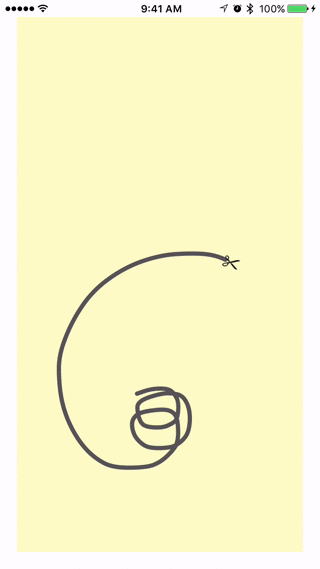
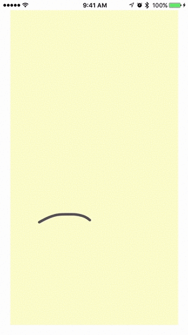

ECCurve
===============

A curve smoothing library for iOS. User can draw a line on the screen and those "square corners" will be corrected to round corners so smooth curve can be shown!

	
	

## Overview

If users' finger is outside the drawing area, the bezier path will still inside the drawing area (along on the boundary)

Scissor icon is added at the end of a curve. The direction of the scissor follows the end part of the curve. 

You may want to understand and modify the code inside to fit your project needs. 

Part of the code reference to https://github.com/levinunnink/Smooth-Line-View

## Get Started

Create a new drawing area like the code below. 
Use `andPath: [NSNull null]` if you want no beginning path. 
(Refer to ViewController.h/m for the detail usage.)

```
ecCurveDrawingView = [[ECCurveDrawingView alloc] initWithFrame:drawingArea
andPath: aPath
andCurrentImageSize:CGSizeMake([[UIScreen mainScreen] bounds].size.width - screenMargin*2, [[UIScreen mainScreen] bounds].size.height - screenMargin*2)
andAngle:angleBetweenPreviousAndCurrentPointForScissor
andScissorCenter: [NSValue valueWithCGPoint:scissorCenter]];
```

Copy ECCurveDrawingView.h/m, ECCurveClippingImageModel.h/m for to your Xcode project. 


## License

ECCurve is released under the MIT license. See LICENSE for details.